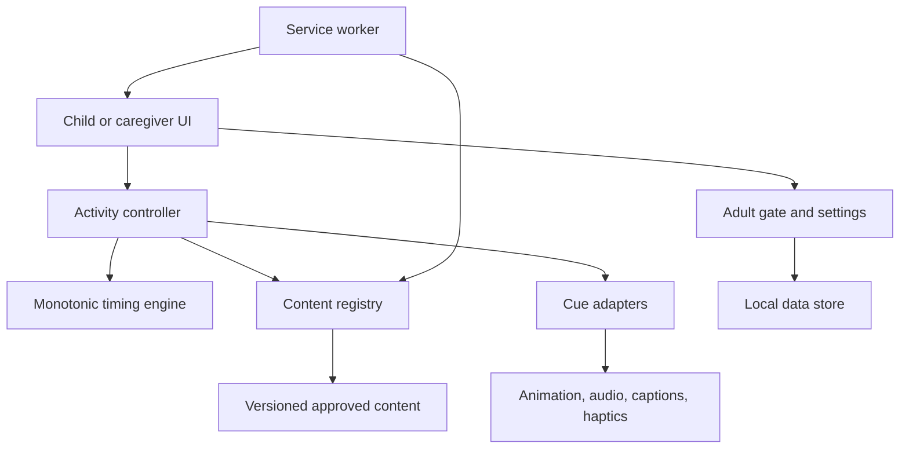

# Kids Breathing Coach — Technical Architecture

**Document ID:** KBC-ARCH-001  
**Version:** 0.1  
**Status:** Proposed MVP baseline

## 1. Decision

Build a client-only, installable Progressive Web App using TypeScript and a component-based UI framework. Core sessions work offline. MVP has no backend, account, remote analytics, advertising SDK, microphone, camera, location, or cloud synchronization.

## 2. Logical Components



## 3. Recommended Stack

- TypeScript
- React with Vite
- CSS design tokens and accessible semantic HTML
- Web Animations API or CSS transforms behind a reduced-motion adapter
- Web Audio/HTML Audio with preloaded local assets
- optional Vibration API with feature detection
- IndexedDB for local history/preferences; localStorage only for trivial flags
- service worker and manifest for offline installation
- Vitest for logic, Playwright for journeys and browser timing tests

Exact dependency versions are pinned at repository initialization.

## 4. Timing Engine

- Use a monotonic clock (`performance.now`) rather than chained timeouts as truth.
- Render from elapsed time and current phase definition.
- Audio, animation, caption, and haptic cues subscribe to the same phase transition.
- Pause stores elapsed position; resume begins with a short normal-breathing transition.
- `visibilitychange`, page freeze, navigation, or lock ends the active activity.
- Never attempt to catch up missed breathing phases after throttling.
- Timing tolerances are tested on supported mobile Safari and Chrome devices.

## 5. Content Model

```yaml
activity_id: controlled-string
version: semver
approval: draft | reviewed | approved | retired
track: little | big
title: localized-string
phases:
  - type: demo | inhale_easy | exhale_easy | normal | narration | choice
    nominal_ms: integer
    min_ms: integer
    max_ms: integer
    character_action: controlled-string
    narration_asset: local-ref
    caption: localized-string
interrupt_behavior: end_to_normal
safety_copy_version: string
reflection_set: controlled-string
```

The engine rejects unapproved content in production builds.

## 6. Local Data

Stores: settings, localProfiles, favorites, activityHistory, contentVersion, safetyAcknowledgement. Profiles use random local IDs and optional nonunique nickname/avatar. No exact birthday or free text.

History is capped and deletable. Export is deferred. If storage fails, activities still run without persistence.

## 7. Privacy and Network Policy

- Content and media are packaged with the app shell.
- Production Content Security Policy defaults to self-only resources.
- No third-party fonts, pixels, analytics, crash SDKs, ads, embeds, or remote media.
- Network requests are allowlisted and absent from the core child experience.
- Build verification fails if an undeclared external domain is referenced.
- A future backend requires a new privacy architecture and approval.

## 8. Accessibility Architecture

- State changes publish accessible text through restrained live regions.
- Captions are first-class content, not generated from audio.
- All animation respects reduced-motion preference and app override.
- Focus never becomes trapped in the animation surface.
- Stop remains reachable by keyboard, touch, switch control, and screen reader.

## 9. Failure Rules

| Failure | System response |
|---|---|
| Audio decode/playback | Continue captions/visuals |
| Animation failure | Static phase card |
| Haptic unsupported | Continue silently |
| Storage unavailable | Session works; no history |
| Clock discontinuity | End guidance; offer restart |
| Background interruption | End activity; never auto-resume |
| Invalid content | Do not start; return to safe Home state |

## 10. Security Boundary

No secrets exist in the client. Dependencies are locked and scanned. Production excludes debug logs containing child choices or local profile data. Local data is treated as sensitive even though it remains on-device.

## 11. Exit Gate

Architecture is accepted when a vertical slice installs, runs offline, survives storage/audio/haptic failure, ends safely on backgrounding, exposes no external network requests, and passes Stop/Get-a-Grown-up accessibility tests.

## 12. Change History

| Version | Date | Change |
|---|---|---|
| 0.1 | 2026-09-19 | Initial offline PWA, timing, content, storage, privacy, accessibility, and failure architecture. |
